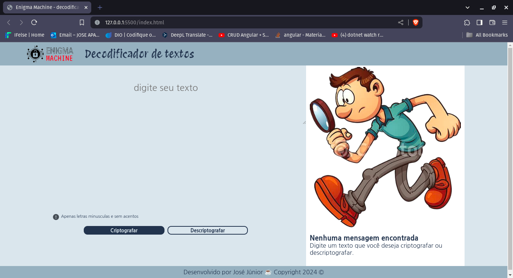

<h1 align="center">

 Criptografe e descriptografe o seu texto 

</h1>

## About
Este é um challenge encriptador/desencriptador de texto, desenvolvido durante a primeira etapa do  projeto **ONE(Oracle Next Education)** da oracle em parceria com a Alura.

## ⚒️ Tools
- [JavaScript](https://developer.mozilla.org/pt-BR/docs/Web/JavaScript)
- [HTML](https://developer.mozilla.org/pt-BR/docs/Web/HTML)
- [CSS](https://developer.mozilla.org/pt-BR/docs/Web/CSS)

## Test the project in
➡️ [Enigma Machine](https://josejunior23.github.io/Challenge-One-T6/)
## Project images 
